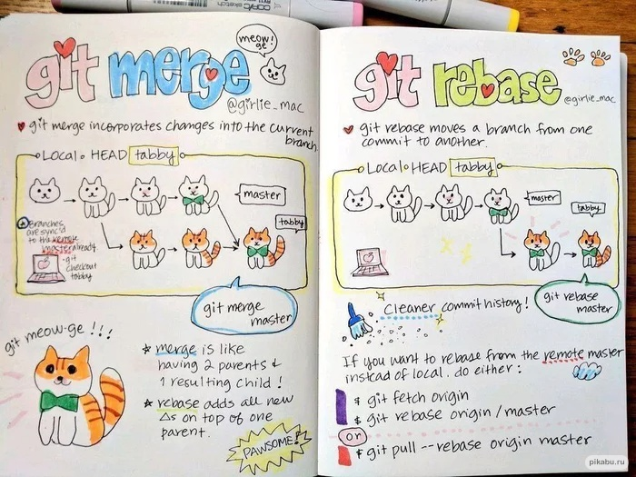
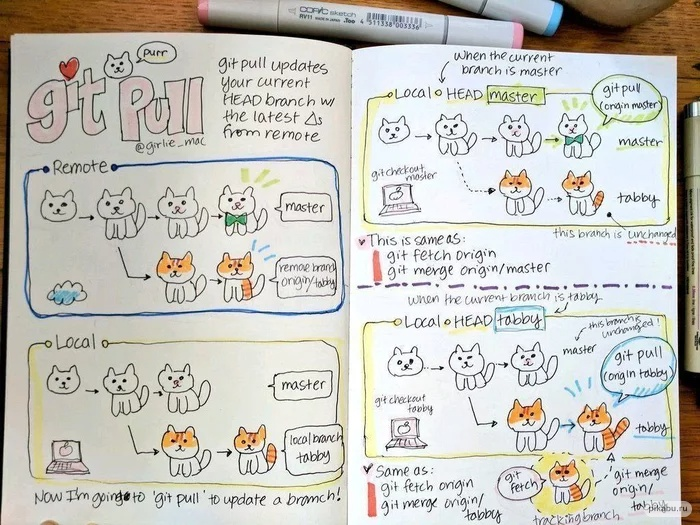

# Инструкция по работе с Git

## Материалы взяты с сайтов 
### [proglib.io](https://proglib.io/p/git-cheatsheet "солянка")
### [habr.com](https://habr.com/ru/company/ruvds/blog/599929/ "разная")
### [gist.github.com](https://gist.github.com/rdnvndr/cb21a06c5a71fd71213aed1619380b8e "бывает")
#
## 1. Как задать имя пользователя и адрес электронной почты
    git config --global user.name "user name"

    git config --global user.email "user email"
#
## 2. Проверить текущие настройки можно Git командой:
    git config --list
#
## 3. Необходимо инициализировать проект. Это делается один раз, но очень необходимо не забывать это делать!!!
    git init
#
## 4. Затем нужно проиндексировать перед коммитом созданные файлы и изменения
    git add index.html
#
## 5. Если создано много файлов или внесено много изменений к ним, то тогда можно использовать следующую Git команду:
    git add .

Данная команда добавит в индекс все файлы, в которых были изменения, а также новые файлы.
#
## 6. После того, как изменения были проиндексированы, их нужно закоммитить:

    git commit –m “Название коммита”

Также можно сократить эти две записи:

    git commit –am “Название коммита”

Эта запись одновременно проиндексирует файлы (за которыми ведется слежка ).И закоммитит их.
#
## 7. После создании нового репозитория на github, он вам сгенерирует команды. Их нужно будет только скопировать и вставить в консоль

    git remote add origin https://github.com/YouName/test.git

    git push -u origin master

Данные Git команды нужно ввести 1 раз. После это го нужно будет указывать только git push, чтобы загрузить данные на Ваш удаленный репозиторий
#
## 8. Для того, чтобы выяснить, в каких файлах есть конфликты, нужно набрать Git команду:

    git status

Все, что находится в HEAD - это наши изменения, и все, что находится после знаков равно - это внешние изменения. Вам нужно выбрать, какие изменения оставить.
#
## 9. После того как решите конфликты, нужно использовать Git команду:

    git commit
#
## 10. Отменить индексацию файла можно так:

    git reset HEAD имя файла
#
## 11. Если вы уже внесли изменения в файл и сохранились, но хотите отменить изменения в файле, то можете указать:

    git checkout -- Имя файла

И он вернет состояние файла предыдущего сохранения
#
## 12. Редактирование последнего коммита:

    git commit --amend -m "Комментарий к коммиту"
#
## 13. Удаление отслеживаемых файлов из текущего рабочего дерева
Удалять файлы из текущего рабочего дерева можно с помощью параметра rm. При этом файлы удаляются и из индекса.

    git rm dirname/somefile.js

Можно также использовать маски файлов (например *.js) для удаления всех файлов, соответствующих критерию.

    git rm dirname/*.html

#
## 14. Переименование файлов

Переименовать файл или папку можно параметром mv. Для него указывается источник source и назначение destination. Источник — реально существующий файл или папка, а назначение — существующая папка.

    git mv dir1/somefile.js dir2

При выполнении команды файл или папка, указанные как источник, будут перемещены в папку назначения. Индекс будет обновлён соответственно, но изменения нужно записать.
#
## 15. Отмена подготовленных и неподготовленных изменений

Восстановить файлы рабочего дерева, не подготовленные к коммиту, можно параметром checkout. Для проведения операции требуется указать путь к файлу. Если путь не указан, параметр git checkout изменит указатель HEAD, чтобы задать указанную ветку как текущую.

    git checkout somefile.js

Восстановить подготовленный файл рабочего дерева можно параметром reset. Потребуется указать путь к файлу, чтобы убрать его из области подготовленных файлов. При этом не будет производиться откат никаких изменений или модификаций — однако файл перейдёт в категорию не подготовленных к коммиту.

    git reset HEAD somefile.js

Если нужно выполнить это действие для всех подготовленных файлов, путь к ним указывать не надо.

    git reset HEAD

#
## 16. Изменение последнего коммита

Внести изменения в последний коммит можно параметром commit с флагом --amend. Например, вы записали изменения, внесённые в ряд файлов, и поняли, что допустили ошибку в сообщении коммита. В этом случае можете воспользоваться указанной командой, чтобы отредактировать сообщение предыдущего коммита, не изменяя его снимок.

    git commit --amend -m "Updated message for the previous commit"

С помощью amend прекрасно исправляются локальные коммиты, а исправления можно передать в общий репозиторий. Однако изменять коммиты, уже доступные другим пользователям, не следует. Помните, что изменённые коммиты являются совершенно новыми, а предыдущий коммит уже не будет доступен в текущей ветке. Последствия будут такими же, как при отмене изменений публичного снимка.
#
## 17. Откат последнего коммита

Откатить последний коммит можно с помощью параметра revert. Создастся новый коммит, содержащий обратные преобразования относительно предыдущего, и добавится к истории текущей ветки.

    it revert HEAD

▍ Разница между revert и reset

Команда git revert отменяет изменения, записанные только одним коммитом. Она не откатывает проект к более раннему состоянию, удаляя все последующие коммиты, как это делает команда git reset.

У команды revert есть два крупных преимущества по сравнению с reset. Во-первых, она не меняет историю проекта и производит операцию, безопасную для коммитов. Во-вторых, её объектом выступает конкретный коммит, созданный в любой момент истории, а git reset всегда берёт за точку отсчёта текущий коммит. К примеру, если нужно отменить старый коммит с помощью git reset, придётся удалить все коммиты, поданные после целевого, а затем выполнить их повторно. Следовательно, команда git revert — гораздо более удобный и безопасный способ отмены изменений.    
# 
# #  18 Синхронизация в Git
    git remote 
    git fetch 
    git push 
    git pull
В системе SVN используется единый централизованный репозиторий, служащий центром связи для разработчиков. Совместная работа ведется путем передачи наборов изменений между рабочими копиями разработчиков и центральным репозиторием. Однако модель распределенной совместной работы в Git предполагает, что каждый разработчик использует собственную копию репозитория со своей локальной историей и структурой веток. Обычно пользователи делятся не отдельными наборами изменений, а сериями коммитов. Вместо того чтобы выполнять коммит одного набора изменений из рабочей копии в центральный репозиторий, Git позволяет передавать между репозиториями целые ветки.
## 18.1    git remote
Команда git remote позволяет создавать, просматривать и удалять подключения к другим репозиториям. Удаленные подключения скорее похожи на закладки, чем на прямые ссылки на другие репозитории. Они служат удобными именами, с помощью которых можно сослаться на не очень удобный URL-адрес, а не предоставляют доступ к другому репозиторию в режиме реального времени.

Например, на следующем рисунке изображены два удаленных подключения из вашего репозитория к центральному репозиторию и репозиторию другого разработчика. Вместо того, чтобы ссылаться на них по их полным URL-адресам, вы можете передавать командам Git только ярлыки origin и john.

Использование git remote для подключения к другим репозиториям
Обзор использования git remote
По сути, команда git remote — это интерфейс для управления списком записей об удаленных подключениях, которые хранятся в файле /.git/config репозитория. Для просмотра текущего состояния списка удаленных подключений используются следующие команды.

Просмотр конфигураций удаленных репозиториев Git

    git remote
Список ваших удаленных подключений к другим репозиториям.

    git remote -v
Аналогично команде выше, но включает URL-адрес каждого подключения.

Создание и изменение конфигураций удаленных репозиториев Git
Команда git remote также предоставляет удобный способ изменения файла /.git/config репозитория. Перечисленные ниже команды позволяют управлять подключениями к другим репозиториям и изменять файл /.git/config репозитория. Такого же результата можно достичь, напрямую отредактировав файл /.git/config с помощью текстового редактора.

    git remote add <name> <url>
Создание нового подключения к удаленному репозиторию. После добавления удаленного репозитория имя ＜name＞ можно использовать в качестве удобного ярлыка для адреса ＜url＞ в других командах Git.

    git remote rm <name>
Удаление подключения к удаленному репозиторию с именем ＜name＞.

    git remote rename <old-name> <new-name>
Переименование удаленного подключения с имени ＜old-name＞ на ＜new-name＞.

Обсуждение git remote
Git предоставляет каждому разработчику полностью изолированную среду разработки. Информация не передается между репозиториями автоматически. Вместо этого разработчикам нужно вручную загружать вышестоящие коммиты в локальный репозиторий или вручную отправлять локальные коммиты обратно в центральный репозиторий. Команда git remote представляет собой простой способ передачи URL-адресов в эти команды обмена.

Удаленное подключение к origin
В процессе клонирования с помощью команды git clone автоматически создается удаленное подключение к исходному репозиторию (такое соединение называется origin). Это позволяет разработчикам, создающим локальную копию центрального репозитория, легко загружать вышестоящие изменения или публиковать локальные коммиты. Именно поэтому большинство проектов на основе Git называют свой центральный репозиторий origin.

URL-адреса репозиториев
Git поддерживает различные способы ссылки на удаленный репозиторий. Два наиболее простых способа доступа к удаленному репозиторию: протоколы HTTP и SSH. Протокол HTTP — простой способ разрешить к репозиторию анонимный доступ только для чтения. Пример ниже.

http://host/path/to/repo.git
Однако HTTP-адрес, как правило, не позволяет отправлять коммиты (в любом случае вы не захотите разрешать анонимную отправку изменений с помощью команды push). Чтобы использовать доступ для чтения и записи следует использовать протокол SSH:

ssh://user@host/path/to/repo.git
Вам понадобится лишь действующий аккаунт SSH на хост-машине, а в остальном Git поддерживает аутентифицированный доступ через SSH по умолчанию. Необходимые URL-адреса предоставляются современными безопасными решениями для хостинга от сторонних провайдеров, например Bitbucket.com.

Команды git remote
Команда git remote — одна из многих команд Git, которые принимают дополнительные «подкоманды». Ниже рассмотрены наиболее часто используемые подкоманды git remote.

    ADD <NAME> <URL>
Добавляет запись к ./.git/config для удаленного репозитория с именем ＜name＞ по URL-адресу ＜url＞.

Принимает параметр -f, который запустит команду git fetch сразу после создания записи об удаленном репозитории.

Принимает параметр --tags, который немедленно запустит команду git fetch и импортирует все теги из удаленного репозитория.

    RENAME <OLD> <NEW>
Обновляет ./.git/config для переименования записи с ＜OLD＞ на ＜NEW＞. При этом обновляются все удаленно отслеживаемые ветки и настройки конфигурации удаленного репозитория.

    REMOVE or RM <NAME>
Изменяет ./.git/config и удаляет удаленный репозиторий с именем ＜NAME＞. При этом удаляются все удаленно отслеживаемые ветки и настройки конфигурации удаленного репозитория.

    GET-URL <NAME>
Вывод URL-адресов для записи об удаленном репозитории.

Принимает параметр --push, поскольку URL-адреса чаще отправляют с помощью команды push, а не извлекают с помощью fetch.

При указании параметра --all будут перечислены все URL-адреса для данного удаленного репозитория.

    SHOW <NAME>
Выводит общую информацию об удаленном репозитории с именем ＜NAME＞.

    PRUNE <NAME>
Удаляет из репозитория ＜NAME＞ все локальные ветки, которые отсутствуют в удаленном репозитории.

Принимает параметр --dry-run, который выводит список удаляемых веток, но на самом деле не удаляет их.

Примеры git remote
Зачастую бывает удобно иметь подключение не только к репозиторию origin, но и к репозиториям коллег. Например, если ваш коллега Джон поддерживает общедоступный репозиторий на dev.example.com/john.git, вы можете добавить подключение следующим образом:

    git remote add john http://dev.example.com/john.git
Доступа к индивидуальным репозиториям разработчиков позволяет вести совместную работу за пределами центрального репозитория. Это может быть очень полезно для небольших команд, работающих над большим проектом.

Просмотр удаленных репозиториев
По умолчанию команда git remote отображает ранее сохраненные удаленные подключения к другим репозиториям. Создается однострочный список закладок с именами удаленных репозиториев.

    $ git remote
    origin
    upstream
    other_users_repo
При вызове git remote с параметром -v будет выведен список закладок с именами и соответствующими URL-адресами репозиториев. Параметр -v расшифровывается как «verbose» — подробный. Ниже приведен пример подробного вывода команды git remote.

    git remote -v
    origin  git@bitbucket.com:origin_user/reponame.git (fetch)
    origin  git@bitbucket.com:origin_user/reponame.git (push)
    upstream    https://bitbucket.com/upstream_user/reponame.git (fetch)
    upstream    https://bitbucket.com/upstream_user/reponame.git (push)
    other_users_repo    https://bitbucket.com/other_users_repo/reponame (fetch)
    other_users_repo    https://bitbucket.com/other_users_repo/reponame (push)
Добавление удаленных репозиториев
Команда git remote add используется для создания записи о новом подключении к удаленному репозиторию. После добавления удаленного репозитория имя можно использовать в качестве удобного ярлыка для адреса в других командах Git. Дополнительные сведения о принятом синтаксисе URL-адресов см. в разделе «URL-адреса репозиториев» ниже. Эта команда создаст новую запись в файле ./.git/config репозитория. Ниже приведен пример обновления этого файла конфигурации.

    $ git remote add fake_test https://bitbucket.com/upstream_user/reponame.git; [remote "remote_test"] 
    url = https://bitbucket.com/upstream_user/reponame.git 
    fetch = +refs/heads/*:refs/remotes/remote_test/*
Проверка удаленного репозитория
Для получения подробного вывода о конфигурации удаленного репозитория к команде git remote можно добавить подкоманду show. Вывод будет содержать список веток, связанных с удаленным репозиторием, а также конечных точек, подключенных для извлечения (fetch) и отправки (push).

    git remote show upstream
    remote upstream
    Fetch URL: https://bitbucket.com/upstream_user/reponame.git
    Push URL: https://bitbucket.com/upstream_user/reponame.git
    HEAD branch: main
    Remote branches:
      main tracked
      simd-deprecated tracked
      tutorial tracked
    Local ref configured for 'git push':
      main pushes to main (fast-forwardable)
Получение и извлечение данных из удаленных репозиториев Git
Отправка данных в удаленные репозитории Git
Для записи данных в удаленный репозиторий используется команда git push.

## 18.2 git push <remote-name> <branch-name>
В этом примере состояние локальной ветки ＜branch-name＞ передается в удаленный репозиторий, обозначенный как ＜remote-name＞.

Переименование и удаление удаленных репозиториев
    git remote rename <old-name> <new-name>
Принцип работы команды git remote rename очевиден из названия. В результате ее выполнения происходит переименование удаленного подключения с имени ＜old-name＞ на ＜new-name＞. Кроме того, изменяется контент ./.git/config для переименования записи для удаленного репозитория.

    git remote rm <name>
Команда git remote rm удаляет подключение к удаленному репозиторию, обозначенному с помощью параметра ＜name＞. Чтобы показать работу команды, «отменим» добавление из последнего примера. После выполнения команды git remote rm remote_test мы увидим, что запись [remote "remote_test"] удалена из контента ./.git/config.
> ## Разработчики сейчас решают задачи каждый на своей ветке, это пришло к нам от наших предков - обезьян
#
## p.s. Как правильно вести конспекты на лекциях по Git и как вызывать конфликт в новой версии
    git merge --ff имя ветки

